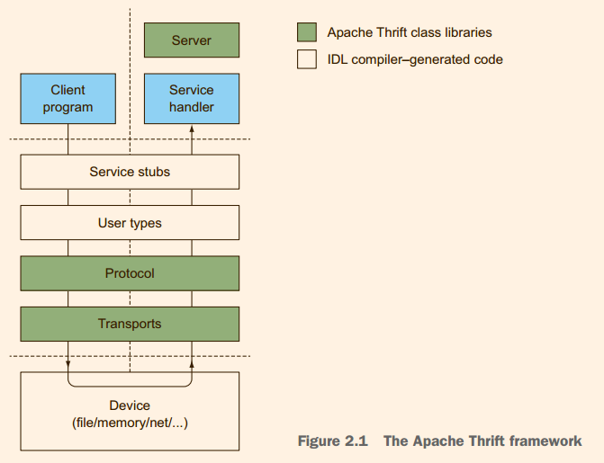
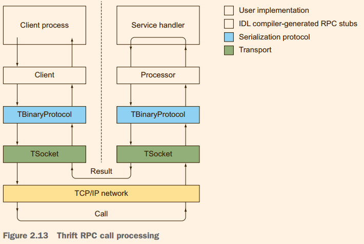

# Thrift

## 简单使用

+ **安装**

  安装多个版本（指定安装目录，下面内容可放到.sh文件sudo执行）:

  ```shell
  # 2021.12.31 当前最新版本 0.15.0 os: linuxmint18
  wget https://dlcdn.apache.org/thrift/0.15.0/thrift-0.15.0.tar.gz 
  tar zxvf thrift-0.15.0.tar.gz -C /opt/
  cd /opt
  ln -s thrift-0.15.0 thrift		# 安装其他版本这里要将thrift指向新的安装包
  cd ./thrift
  # 安装源码编译时的依赖
  apt-get install automake bison flex g++ git libboost-all-dev libevent-dev libssl-dev libtool make pkg-config
  # 源码编译安装, 详细看根目录下的README.md
  #  	首次在源存储库之外构建，需要生成配置脚本
  ./bootstrap.sh
  # 	配置 detail: ./configure --help
  mkdir -p exec/bin exec/lib		# 可执行文件、头文件和依赖库会安装到/opt/thrift/exec下
  # 	  默认是/usr/local 这里放在安装包下,不然装多版本会被覆盖
  ./configure --prefix=/opt/thrift/exec
  make
  make install
  # 执行测试
  # make -k check
  # make cross
  # 添加环境变量
  sed -i '$a\export PATH=/opt/thrift/exec/bin:$PATH' /home/lee/.zshrc
  ```

+ **编写.thrift定义RPC接口**

+ **使用Thrift Compiler生成`业务接口`、`服务端业务处理器Processor`、`客户端Client`**

  使用时只需要编写IDL文件定义RPC接口，服务端实现接口并提供对应的TProcessor实例（类似Controller），客户端实例化Client并执行调用。

  ```xml
  <dependency>
      <groupId>org.apache.thrift</groupId>
      <artifactId>libthrift</artifactId>
      <version>0.15.0</version>
  </dependency>
  ```

+ **执行测试**


## 工作原理

打一个不太准确的比喻：RPC框架类似于Netty + IDL Stub。

### 架构

来源于《Programmer's Guide to Apache Thirft》：



来源于网络（将每一层的可选方案都列举出来了）：


架构图和网络OSI模型有点类似。

主要分为5层：

+ **The RPC Server library**

  服务器是专门为托管一个或多个Apache Thrift服务的程序。将TTransport、TProtocol和TProcessor等Thrift各种特性组合起来创建一个服务端示例，对外提供接口服务。

  Thrift 提供了多种服务器模型，不同的语言有不同的实现。

+ **RPC Service Stubs**

  

  RPC调用的服务器端由两个代码元素组成。处理器是服务器端idl生成的存根，与客户端存根相对应。Thrift编译器为每个idl定义的服务生成客户端和处理器对。

  处理器使用协议栈来反序列化服务方法调用请求，调用适当的本地函数。本地函数调用的结果被处理器打包成结果结构并发送回客户端。处理器本质上是一个调度器，接收来自客户机的请求，然后将它们发送给请求者。

+ **User-Defined Type Serialization**

  IDL(接口定义语言)提供了统一的在多语言平台通用的语言，写入信道时先将模块使用语言的数据类型转换为Thrift IDL 数据类型，读取时将Thrift IDL类型转换为模块使用语言的数据类型，转换过程依赖Stub。

+ **The Serialization Protocol library**

  这里的协议指的是如何序列化数据类型。Thrift类型系统包括在大多数语言的所有重要的基类型(int，double、string等等)，以及一些大量使用和广泛支持的容器类型(map、set、list)。

  协议位于传输栈的顶部。负责数据类型和字节流的相互转换。传输层只看到不透明的字节流，协议将数据类型转换为字节流，反之亦然。

  **提供的协议**

  + **二进制协议(The Binary Protocol)**

    默认协议，二进制编码，数据转换最快（使用最小的CPU资源）。

  + **紧凑的协议(The Compact Protocol)**

    采用高效率密集的压缩二进制的数据传输协议，适用于有IO瓶颈的场景。

  + **JSON协议(The JSON Protocol)**

    JSON协议将输入转换为JSON格式的文本。在这三个协议中占用最大的流量和CPU；优点是广泛的互操作性和可读性，传输过程中可抓包直接读取内容（没有加密前提下）。

  **接口**

  + **TProtocol**

    所有具体的协议实现都遵循该接口。这个接口定义了读取和写入每种Apache Thrift类型的方法，以及用于序列化容器、用户定义类型和RPC消息的组合方法。其中一个主要的特征就是通过struct可以支持用户自定义类型。

+ **The Transport library**

  传输层：能使上层协议无需了解底层通信原理，就可以读写字节流。这允许在不影响软件上层的情况下，向平台添加新设备和中间件系统（比如之前通过Socket通信，后新接入一个通过AMQP协议通信的服务，只需要新服务的AMQP代码实现Transport接口，支持在编译时或运行时选择传输方式）。

  **接口**

  + **TTransport**

    提供IO打开关闭读写等方法。

    底层支持通过**内存**（如：TMemoryBuffer）、**文件**（如：TSimpleFileTransport）、**网络**（如：TSocket，通过TCP/IP协议通信）的方式进行数据传输。另外很多语言的Thrift库还支持通过HTTP协议通信，也可以自定义**Transport**支持其他的网络协议或设备。比如上面第二张架构图中显示还支持**管道**、**HTTPS**。

    分层传输（Layered transports）：翻译的不好，不过个人理解就像OSI的应用层协议相对于传输层协议一样，做了更上一层封装，提供可互操作和可重用的组件。

    分层传输向客户端公开标准的Apache Thrift TTransport接口，并依赖于下面一层的TTransport接口。通过这种方式，可以使用一个或多个传输层来形成传输堆栈。如：TFramedTransport，在某些场景下可以进行更高效的消息处理，允许接收方以帧的大小进行读取，然后提供帧所需的精确大小的缓冲区。

    分层传输提供的另一个重要特性是缓冲。TFramedTransport隐式地缓冲写入，直到调用flush()方法，此时帧大小和数据被写入到下面的层。TBufferedTransport是TFramedTransport的替代品，可以在不需要帧时提供缓冲。一些语言将缓冲构建到端点解决方案中，而不提供TBufferedTransport (Java就是一个例子)。

    服务器传输（Server transports）: 当两个进程通过网络连接通信时，服务器必须侦听客户端的连接，在连接到达时进行接受。抽象的服务器连接接受器的接口通常被命名为TServerTransport。TServerTransport最流行的实现是TServerSocket，用于TCP/IP网络。服务器传输将每个新连接连接到TTransport实现，以处理单个连接的I/O。服务器传输遵循工厂模式，TServerSockets制造TSockets, TServerPipes制造TServerPipes、TPipes，等等(见图2.7)。

### Thrift RPC 调用流程详解


## 基础知识

### RPC Server


### IDL & Stub (Handler&Client)

#### IDL

支持跨语言。

#### Stub

Stub通常翻译为“存根”，是客户端或服务端参数或返回与IDL类型进行相互转换的代码。

客户端Stub：存放服务端的地址消息，再将客户端的请求参数打包成网络消息，然后通过网络远程发送给服务方。

服务端Stub：接收客户端发送过来的消息，将消息解包，并调用本地的方法。比如前面说的`Processor`。

> 维基百科 RPC Stub定义：
>
> A stub in distributed computing is a piece of code that converts parameters passed between client and server during a remote procedure call (RPC).
>
> Stub还有“末梢”的意思，“存根”感觉和这里说的转换没有什么关系，感觉翻译成“末梢”更好，Stub就像是服务的神经末梢一样。

### 序列化协议

### 字节流传输

### 企业应用


## 技术对比

### Thrift VS SOAP、REST、Protocol Buffers、Avro


## 参考

+ 《Programmer's Guide to Apache Thirft》

