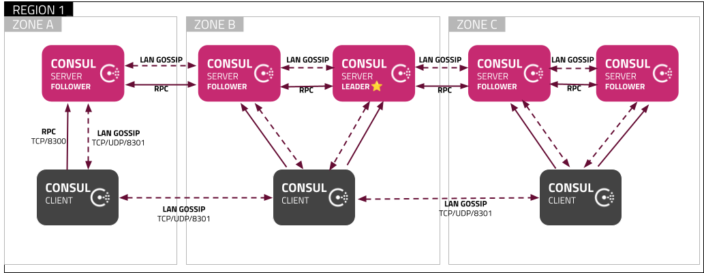

# 服务发现组件

## Consul

### 架构

官方推荐的架构：



Consul Agent 是Consul的核心。维护成员信息、注册服务、运行检查、响应查询等等。Agent 必须在作为Consul集群一部分的每个节点上运行。Agent 以 client 或 server 模式运行。

### 安装

#### 压缩包

```shell
wget https://releases.hashicorp.com/consul/1.15.2/consul_1.15.2_linux_amd64.zip
# 单机启动
# 开发环境推荐
./consul agent -dev
# 这种方式单击启动日志有Error，估计只是用于集群模式启动用的
./consul agent -server=true -datacenter=dc-local -node=node-local -bootstrap-expect=1 -bind=127.0.0.1 -grpc-port=8502 -data-dir=./data -log-level=debug -ui
```

解压后发现就是一个二进制可执行程序。

Agent 参数说明：参考`consul agent --help`，[Consul Agent](https://developer.hashicorp.com/consul/docs/agent) 、[Agents Configuration File Reference](https://developer.hashicorp.com/consul/docs/agent/config/config-files)

常用参数说明：

- `-server`：指定该节点为服务器（Server）节点。
- `-ui`：启用 Web UI 界面，用于在浏览器中访问 Consul 的 Web 界面。
- `-bind`：指定节点的绑定地址为 172.17.0.2，用于集群节点间交互。
- `-bootstrap`：指定该节点为 Bootstrap 节点，用于引导 Consul 集群的初始化过程。旧版本才用这个。
- `-bootstrap-expect=<value>`： 新版本用这个代替 `-bootstrap`。
- `-node`：指定节点的名称为 consul-server1。
- `-client`：指定客户端（Client）连接Server的地址（可绑定多个），表示该节点对外提供服务的 IP 地址，默认是127.0.0.1。
- `-config-dir=<value>`：要加载的配置文件的目录。
- `-config-file=<value>`： 要加载的配置文件。
- `-data-dir=<value>`：数据目录。
- `-dev`：以开发模式启动。
- `-domain=<value>`：用于DNS接口的域名。
- `-http-port=<value>`：要监听的HTTP API端口。默认端口8500。

#### docker

```shell
docker pull consul:1.15.2
# 单节点启动，但是测试不好用
docker run -d -p 8500:8500  -p 8600:8600/udp \
	--name=consul-single  \
	consul:1.15.2 agent -server -ui -bootstrap-expect=1 -node='consul-single'
```

### 运维

+ [CLI](https://developer.hashicorp.com/consul/commands)

+ [API](https://developer.hashicorp.com/consul/api-docs)

### 集成到Spring Boot

[Spring Cloud Consul](https://docs.spring.io/spring-cloud-consul/docs/3.1.2/reference/html/)